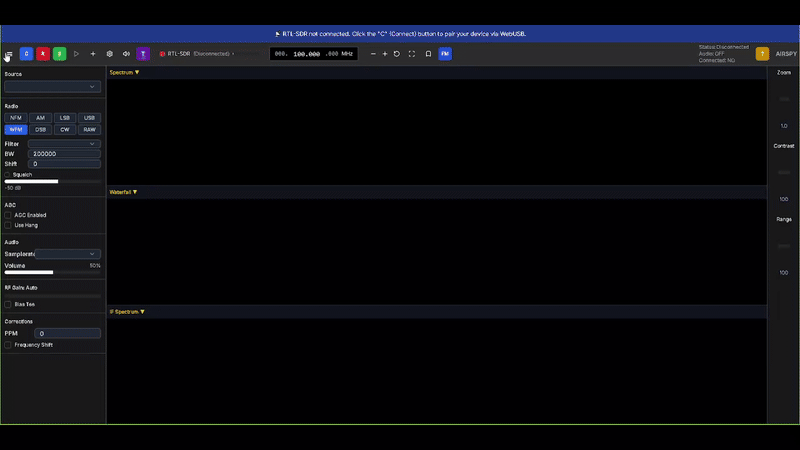

# SDRSharp Web

A web-based SDRSharp client for controlling RTL-SDR devices directly from your browser.


## Overview

SDRSharp Web is an open-source web application that allows you to control and interface with RTL-SDR (Software Defined Radio) devices through your web browser. This project leverages WebUSB technology to establish direct connections to RTL-SDR hardware without requiring additional drivers or software installations.

## Features

- Direct RTL-SDR device control via browser
- Multiple demodulation modes
- Real-time spectrum visualization
- Adjustable parameters (gain, sample rate, frequency)
- Responsive design works on desktop and mobile
- Dark/light theme support

## Getting Started

### Prerequisites

- A compatible RTL-SDR device
- A modern web browser with WebUSB support (Chrome, Edge, Opera)
- Node.js (v16 or newer)

### Installation

1. Clone the repository:
   ```
   git clone https://github.com/atiilla/sdrsharp-web.git
   cd sdrsharp-web
   ```

2. Install dependencies:
   ```
   npm install
   ```

3. Run the development server:
   ```
   npm run dev
   ```

4. Open your browser and navigate to `http://localhost:3000`



## Usage

1. Connect your RTL-SDR device to your computer
2. Click the "Connect" button in the application
3. Grant USB access permissions when prompted by your browser
4. Adjust frequency, demodulation mode, and other parameters as needed

## Technologies Used

- Next.js 15
- React 19
- WebRTL-SDR library
- Radix UI components
- Tailwind CSS
- Zustand for state management

## Contributing

Contributions are welcome! Please feel free to submit a Pull Request.

## Disclaimer

**IMPORTANT NOTICE:**

This software is provided "as is", without warranty of any kind, express or implied, including but not limited to the warranties of merchantability, fitness for a particular purpose, and noninfringement. In no event shall the authors or copyright holders be liable for any claim, damages or other liability, whether in an action of contract, tort or otherwise, arising from, out of or in connection with the software or the use or other dealings in the software.

The SDRSharp Web application interfaces with radio hardware and may enable reception of radio frequencies. Users must be aware of and comply with all local laws and regulations regarding radio reception. In many jurisdictions, certain frequency ranges are restricted or require appropriate licensing. The user assumes all responsibility for ensuring legal compliance when using this software.

By using this software, you acknowledge that you have read this disclaimer, understand it, and agree to be bound by its terms.

## License

This project is licensed under the MIT License - see the [LICENSE](./LICENSE) file for details.